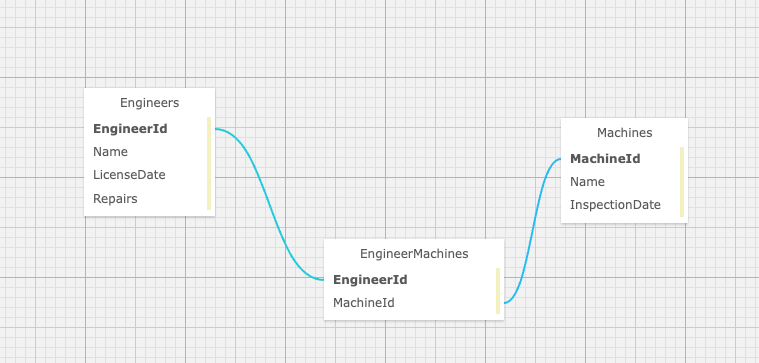

# _SillyStringz Factory_

#### By: _**Albert Lee**_

#### _This MVC application creates a webpage that tracks a Many-to-Many Relationship between Engineers and Machines._

## Technologies Used
* C#
* ASP.NET Core MVC EF
* MySQL, MySQL Workbench
* Entity
* dotnet script, REPL
* Razor View Engine
* NuGet
* LINQ
* Bootstrap CSS

## Description

This project is part of the Epicodus School, focusing on MVC framework and SQL databases. The user will be able to assign many engineers to a machine, and many machines to an engineer. The user can also see a list of engineers or machines, with full CRUD functionality. The data is displayed with Razor and HTML helpers. Databases will save data in an many-to-many relationship. 



## Setup/Installation Requirements

### Application Setup
* _Install [.NET 5.0](https://dotnet.microsoft.com/download/dotnet/5.0)_
* _Clone repository to desired location_
  > https://github.com/leesga8/Factory
* _Open the terminal on your desktop and navigate to_
  >Factory.Solution/Factory
* _Create a file called `appsettings.json`_
* _Write following code with your password replacing `YOUR_DATABASE` and `YOURPASSWORDHERE`_
```{
    "ConnectionStrings": {
    "DefaultConnection": "Server=localhost;Port=3306;database=YOUR_DATABASE;uid=root;pwd=YOURPASSWORDHERE;"
      }
    }
```

### Database Setup/Installation 
* _Download and open MqSql Workbench and connect to localhost:3306_
* _In the Navigator > Administration window, select Data Import/Restore_
* _In Import Options select Import from Self-Contained File_
* _Select albert_lee.sql_
* _In 'Import Progress' click `Start Import`_
* _In the terminal run `dotnet ef database update`_
* _Run `dotnet restore` and `dotnet run` in terminal_

## Known Bugs

* _No known bugs_

## License

[MIT](https://opensource.org/licenses/MIT)

Copyright (c) 2021 Albert Lee

## Contact Information

Albert Lee: <leesga8@gmail.com>